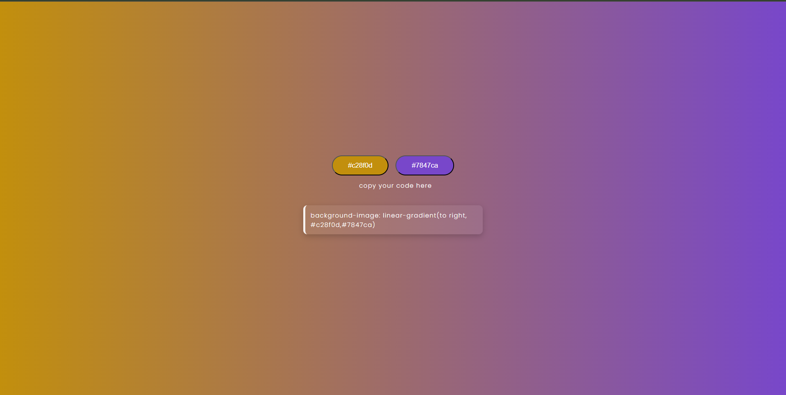

# 🎨 Gradient Generator

A simple gradient background generator built with **HTML, CSS, and JavaScript**.  
It allows you to generate random hex colors and apply them as background gradients.

## 🚀 Live Demo
🔗 [Click here to view the live project](https://gradient-generator-lac.vercel.app/)

## 📸 Preview
  


## 🛠️ Tech Stack
- HTML
- CSS
- JavaScript

## ⚡ Features
- Generate random gradient backgrounds
- Copy gradient code for reuse
- Color buttons update according to selected hex values

## 📂 How to Run Locally
1. Clone the repository
   ```bash
   git clone https://github.com/your-username/gradient-generator.git
